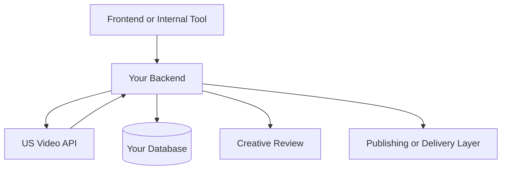

# Architecture And Workflow

US Video API is easiest to integrate as an async job system behind your own application layer.

## High-Level Flow

```mermaid
flowchart LR
    A[Your App or Agent] --> B[POST /v1/videos]
    B --> C[US Video API Job Created]
    C --> D[Store job_id in your system]
    D --> E[Poll GET /v1/videos/{id}]
    E --> F[Completed Asset URL]
    F --> G[Your CRM / CMS / Ad Workflow]
```

## Recommended Application Shape



## Why This Structure Works

- production API keys stay on your backend
- prompts, job IDs, and outputs stay auditable in your own system
- retries and timeout handling stay under your control
- downstream delivery can be adapted to CRM, CMS, ads, or internal ops tooling

## Common Enterprise Patterns

- one service creates jobs
- one worker polls and updates job state
- one internal layer approves, routes, or publishes outputs

This is a strong fit for:

- agencies
- ecommerce automation stacks
- local business marketing services
- AI agent products
- internal creative tooling

## Integration Notes

- use `POST /v1/videos` for job creation
- use `GET /v1/videos/{id}` for async status
- store `job_id` as your stable internal reference
- persist final asset metadata in your own database
